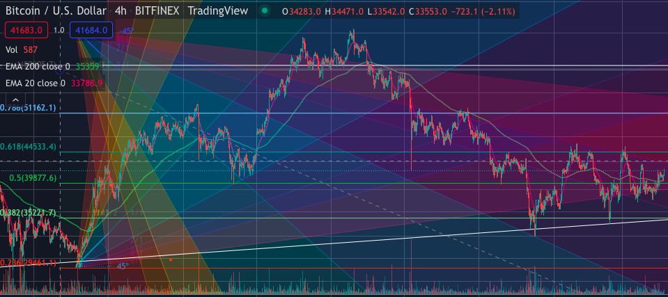

## Background in Cryptocurrency:

Cryptocurrencies have always fascinated me from an early age and this quickly became a huge hobby of mine and hopefully one day I can make a career out of it. I'm only 22 years old, but I've been investing in cryptocurrencies since I was 16 years old. After the years I decided to take my interests with crypto to the next level and started swingtrading the market when I was about 19.

**My Favorite Coins:**

* Ethereum
* Vechain
* Nervos Network

Currently I run a cryptocurrency social media group of around 70 members and we actively trade and discuss possible investment strategies during the market's volitile conditions Over the past couple years we've successfully outperformed the S&P 500 by over 1000%.

**Example of some of the chart analysis we do:**

 *The technical indicators being used in this chart are Fibbonacci Retracements and The Gann Fan.*

[Return Home](README.md)

[Next (Coding Background)](page4.md)   
