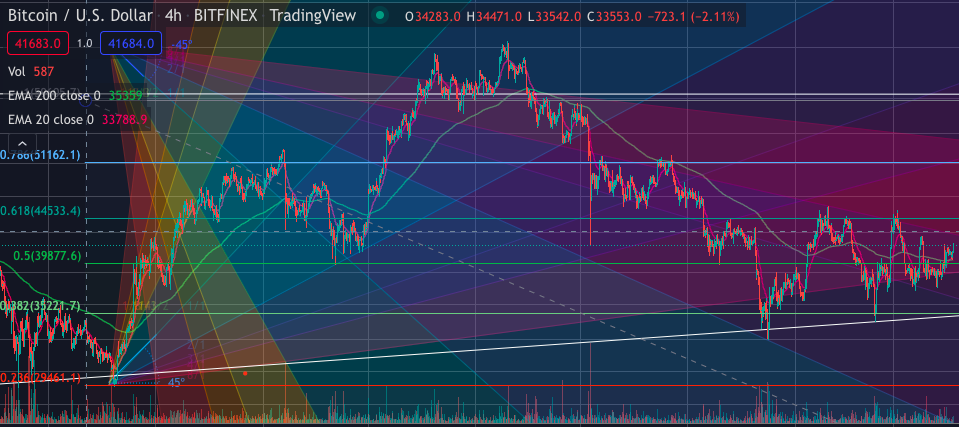

# MidtermProject
Michael Schmidt's Midterm Project

# GitHub Home Page

## About Me
My name is Michael Schmidt and I'm a Senior at the University of Missouri - Columbia. My major is in economics as I am persuing a path in becoming a financial analyst. Coding has only ever been a hobby of mine; however, Outside of coding I have a few other hobbies like trading cryptocurrencies and graphic design for my clothing brand called Censored Clothing.

[Read more about me](page2.md)

Examples of my graphic design work can be seen on our brand's  [Instagram Page](https://www.instagram.com/censorshipped/?hl=en)

## Favorite Coding Project:

```
print("M")
print("i")
print("z")
```
**Coding Experience With:** 
	
* C Code
* JavaScript
* HTML
* Python


## More
> This is my first time using Markdown and I find it to make 

## Here is 



## Example of Previous C Code:


page2.md

# This is page 2 liked to the readme that it home page

#### re
